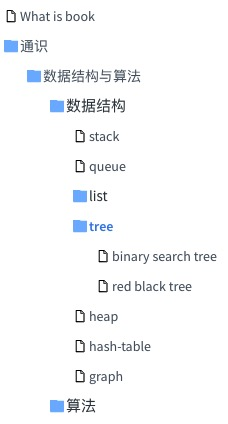

# docsify-sidebar-collapse


Support docsify sidebar catalog expand and collapse

## Preview


## Usage

Firstly, make sure that the [loadSidebar](https://docsify.js.org/#/configuration?id=loadsidebar) config is enabled，and the Markdown file `_sidebar.md` is provided in the root directory.

Then insert script into document just like the [official plugins](https://docsify.js.org/#/plugins)'s usage

```html
<script>
  window.$docsify = {
    loadSidebar: true,
    alias: {
      '/.*/_sidebar.md': '/_sidebar.md',
    },
    subMaxLevel: 3,
    ...
    sidebarDisplayLevel: 1, // set sidebar display level
  }
</script>
<script src="//cdn.jsdelivr.net/npm/docsify/lib/docsify.min.js"></script>

<!-- plugins -->
<script src="//cdn.jsdelivr.net/npm/docsify-sidebar-collapse/dist/docsify-sidebar-collapse.min.js"></script>
```

## \_sidebar.md demo

```
- [数据结构与算法](/general/algorithm/README.md)
  - 数据结构
    - [stack](/general/algorithm/data-structures/stack/README.zh-CN.md)
    - [queue](/general/algorithm/data-structures/queue/README.zh-CN.md)
    - list
      - [linked-list](/general/algorithm/data-structures/linked-list/README.zh-CN.md)
      - [doubly-linked-list](/general/algorithm/data-structures/doubly-linked-list/README.zh-CN.md)
    - [tree](/general/algorithm/data-structures/tree/README.zh-CN.md)
      - [binary search tree](/general/algorithm/data-structures/tree/binary-search-tree/README.md)
      - [red black tree](/general/algorithm/data-structures/tree/red-black-tree/README.md)
    - [heap](/general/algorithm/data-structures/heap/README.zh-CN.md)
    - [hash-table](/general/algorithm/data-structures/hash-table/README.md)
    - [graph](/general/algorithm/data-structures/graph/README.zh-CN.md)
  - 算法
    - [排序算法](/general/algorithm/algorithms/sorting.md)
- [设计模式](/general/design-pattern/README.md)
- 网络
  - [协议模型](/general/network/protocol-model.md)
  - [TCP/IP](/general/network/tcp-ip.md)
```

## Style demo

- arrow style
  ```html
  <link rel="stylesheet" href="//cdn.jsdelivr.net/npm/docsify-sidebar-collapse/dist/sidebar.min.css" />
  ```

- folder style
  ```html
  <link rel="stylesheet" href="//cdn.jsdelivr.net/npm/docsify-sidebar-collapse/dist/sidebar-folder.min.css" />
  ```
  
